# scratch3 中添加插件系统（中文）

此文是关于如何修改添加 Mpfshell 的 Adapter 插件到 scratch3 vm 系统中，以及基于 mpfshell 实现对应的实例示范，你也可以基于此进行设计和开发属于自己的硬件积木。

我在这里补充一下几个文档

一、如何搭建出本地的 scratch3 环境的文档，[创建你的第一个Scratch3.0 Extension](https://blog.just4fun.site/create-first-Scratch3-Extension.html)。

注意步骤，我这里备份一次我常用步骤，和上述原文会有些许出入。

先准备 scratch-vm 。

```
cd Scratch3
git clone https://github.com/LLK/scratch-vm --depth=1
cd scratch-vm
yarn install
yarn link
yarn add uglifyjs-webpack-plugin
yarn run watch

# 新开一个shell
cd scratch-gui
yarn link scratch-vm
```

完成`yarn link scratch-vm`之后， scratch-gui 就会采用我们开发环境里的 scratch-vm ，而不是默认的 scratch-vm  这样一来我们就可以定制 scratch-vm 了。

再准备 scratch-vm 。

```
node -v # v10.15.0. v11.7.0也没问题 , 推荐使用n来管理nodejs版本
npm install -g yarn
npm install -g webpack
npm install -g webpack-dev-server
mkdir Scratch3 # 
cd Scratch3
git clone https://github.com/LLK/scratch-gui --depth=1

cd scratch-gui
yarn install
```

现在你就得到了一个可在本地运行Scratch3.0编辑器。

运行`webpack-dev-server --https`，打开:`https://127.0.0.1:8601/`

注意，如果 gui 的网站添加的拓展点不开，要么看 F12 报错，要么是 VM 链接不上，需要在 gui 文件夹中 yarn unlink scratch-vm ，后再 yarn link scratch-vm ，重新连接虚拟机。

关于如何修改和添加积木代码，包括实现，请参考原文内容。

二、如何调用 Mpfshell 的 Adapter 插件的接口，[创建你的第一个Scratch3.0 Extension](https://blog.just4fun.site/create-first-Scratch3-Extension.html)。

下载 https://codelab-adapter-docs.codelab.club/user_guide/install/ 的软件打开本地，勾选 extension_mpfshell 插件。

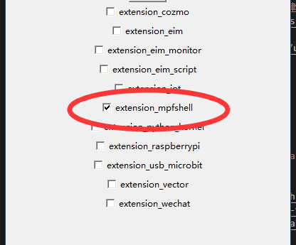

接着的我们看调试接口（DEBUG）

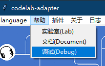

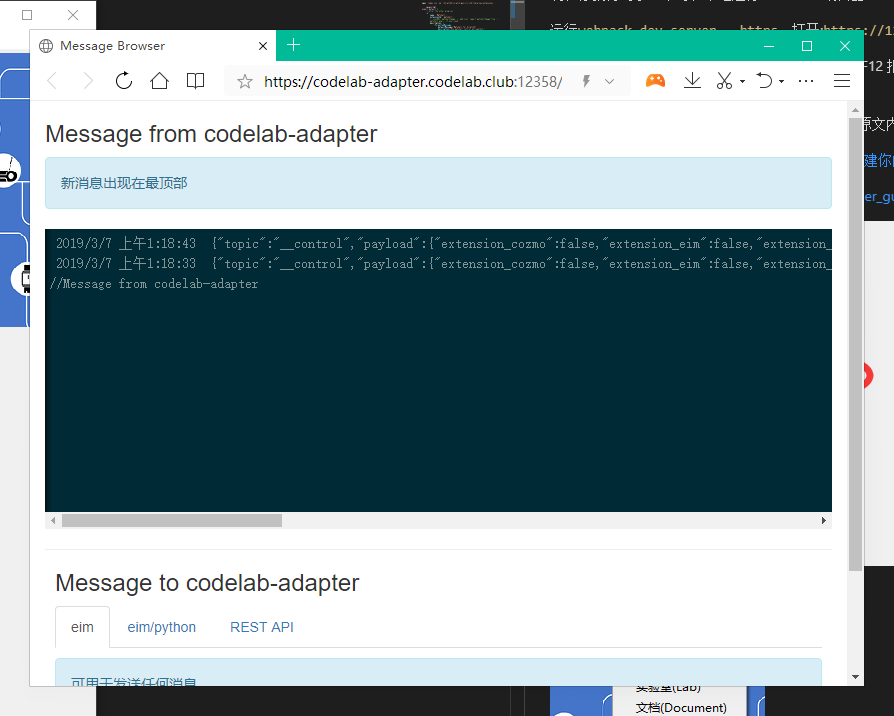

在这里，你可以看到积木实际向插件发送的指令，我们现在尝试一下如何使用 mpfshell 插件吧。

点击如图所示菜单，进入 scratch3 编辑器。

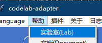

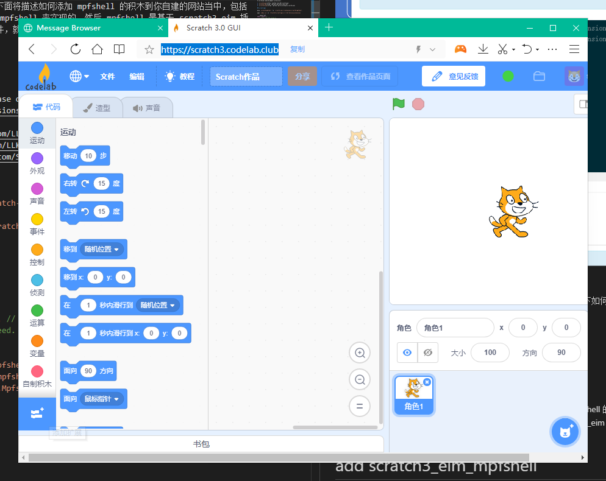

点击左下角，滚动到底下，看到 mpfshell 插件，点开它加载积木拓展。

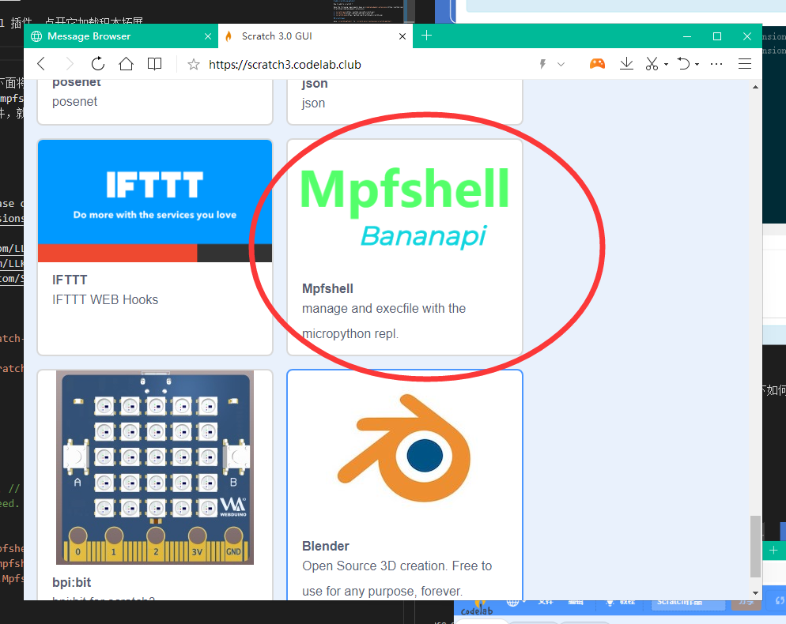

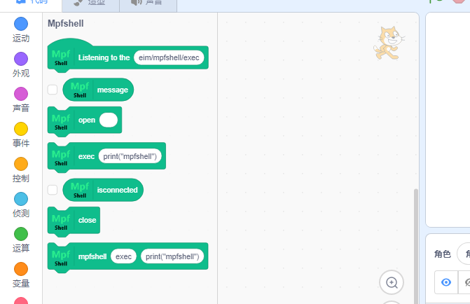

点开两个基本的变量，观察插件是否连接硬件，以及硬件返回了哪些消息，注意小猫头上的绿点，表示 adapter 插件是否被打开（就是 codelab-adapter 软件。

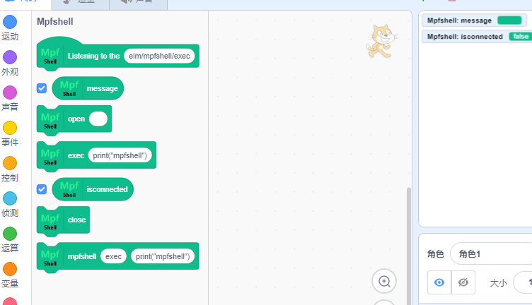

现在你把烧有 MicroPython 固件的硬件插入电脑，如果你没有用过 mpfshell 我建议你先到这里简单学习一下如何使用它，[Hello, World!](https://github.com/BPI-STEAM/BPI-BIT-MicroPython/wiki/helloworld)，然后再回来，你就知道如何烧写 MPY 固件和使用 mpfshell 软件了。

这里我结合一点局部代码[extension_mpfshell.py](https://github.com/junhuanchen/scratch3-eim-mpfshell/blob/eda011a15a181e58cee0a94516ec8b26ae573643/extensions/extension_mpfshell.py#L103-L135)来说明指令，配合调试器可以知道它们背后偷偷摸摸做了什么。

```python
message  = self.read() # python code
# self.logger.debug(message)
topic = message.get("topic")
if self.TOPIC in topic:
    data = message.get('payload')
    obj = topic.split('/')
    mpfs_name = 'default' if len(obj) < 4 else obj[3]
    self.logger.debug(mpfs_name)
    if 'open' in topic:
        message = {
            "topic": topic, 
            "payload": str(self.open_device(mpfs_name, data)).rstrip()
        }
        self.publish(message)
    if 'exec' in topic:
        message = {
            "topic": topic, 
            "payload": str(self.exec_pycode(mpfs_name, data)).rstrip()
        }
        self.publish(message)
    if 'isconnected' in topic:
        message = {
            "topic": topic,
            "payload": str(self.cache[mpfs_name]._MpFileShell__is_open())
        }
        self.publish(message)
    if 'close' in topic:
        self.cache[mpfs_name].do_close(None)
        message = {
            "topic": topic,
            "payload": str(self.cache[mpfs_name]._MpFileShell__is_open())
        }
        self.publish(message)
```

假如我们直接点击 open 积木，它实际上就会向 extension_mpfshell.py 插件发送命令，发送了什么呢？

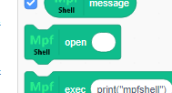

直接看调试器就知道了，但我还是说明一下实现的代码在这里 [scratch3_mpfshell/index.js](https://github.com/junhuanchen/scratch3-eim-mpfshell/blob/eda011a15a181e58cee0a94516ec8b26ae573643/scratch3_mpfshell/index.js#L219-L224)。

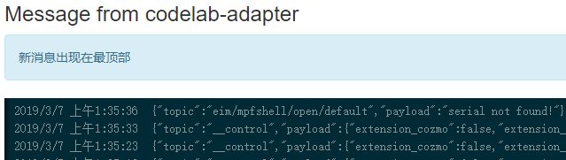

可以看到，实际上就是发送了 `{"topic":"eim/mpfshell/open/default","payload":"serial not found!"}`，然后 extension_mpfshell.py 插件里接受到这些后就对应处理。

具体的源码分析我就不解释太多了，但你知道了这个相互之间的通信关系后无非就是，各自做各自的事情，然后彼此间通信，就这样简单。

那么我在这里介绍一下 mpfshell 积木的具体使用说明。

1. open 积木，参数默认 留空 表示自动查找电脑最新插入的 USB 串口设备，如果不留空，则表示对应的 mpfshell 的 open 操作，如下图。

    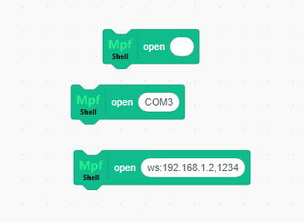

2. exec 积木，参数默认 print("mpfshell") 表示通过 repl 发送给硬件运行一段 python 代码，也就是 mpfshell 的 exec 操作，第二张图表示，在代码中的时候，积木背后做了什么。

    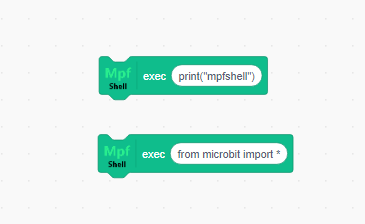
    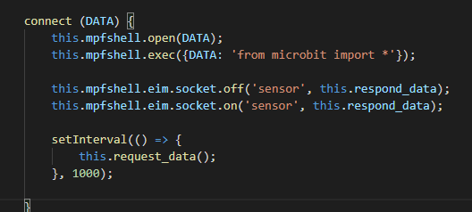

3. 其他不重要的积木，如下图。

    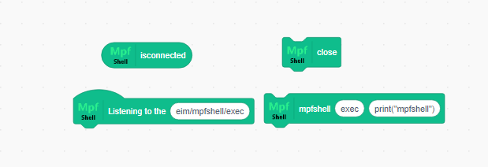

    - isconnected 返回 true 和 false 表示设备是否连接，如果连接不上，直接重启硬件或拔插一下，开发的时候经常会不知道谁又占用了串口。
    - close 关闭打开的设备，让出串口。
    - listening to the (topic) 如果你需要接收 exec 后的数据，你需要用这个，像 debug 一样接收 topic 事件，比如 `eim/mpfshell/open/default` 的监听，如下图。
    - 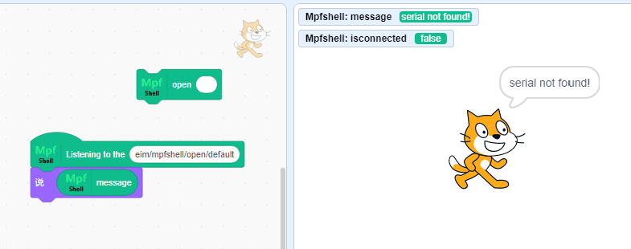
    - 最后一个积木是留给拓展插件命令时调试用的。

现在，你应该可以在 scratch3 中使用 mpfshell 了，但如果你想要基于它开发属于你自己的积木，你需要继续往下看，并且你需要深入到源码当中，如果有不懂的地方，欢迎给我 留言 或提交 issue 。

下面将描述如何添加 mpfshell 的积木到你自建的网站当中，包括提供了一个 bpi:bit 积木实例，并基于 mpfshell 来实现的，然后 mpfshell 是基于 scratch3_eim 插件而来的，也就是说，你只要基于这个插件，就可以直接提交给 codelab 网站后台，实现无缝对接。

对此，我也提供了在 webduino-blockly 当作使用 mpfshell 插件的开发文档，如果你觉得 scratch3 不好用，你也可以使用 允许多语言并动态加载积木 的 [webduino-module-eim
](https://github.com/junhuanchen/webduino-module-eim) ，这只需要你专注实现积木即可。

# add scratch3_eim_mpfshell

How to add to scratch3 ?

Have the following requirements base on [codelab_adapter_extensions](https://github.com/Scratch3Lab/codelab_adapter_extensions).

1. [scratch-gui](https://github.com/LLK/scratch-gui)
2. [scratch-vm](https://github.com/LLK/scratch-vm)
3. [scratch3_eim](https://github.com/Scratch3Lab/scratch3_eim)

## scratch-gui

move `scratch3_mpfshell` to `\scratch-vm\src\extensions\scratch3_mpfshell`.

open `index.jsx` in `\Scratch3\scratch-gui\src\lib\libraries\extensions` .

``` javascript
export default [
    // After the other plug-ins
	,{
        name: 'Mpfshell',
        extensionId: 'mpfshell',
        // iconURL: mpfshellImage, // add icon `import mpfshellImage from './mpfshell.png';` if your need.
        description: (
            <FormattedMessage
                defaultMessage="Mpfshell for Scratch3"
                description="Use mpfshell control micropython."
                id="gui.extension.Mpfshell.description"
            />
        ),
        featured: true
    }
]
```

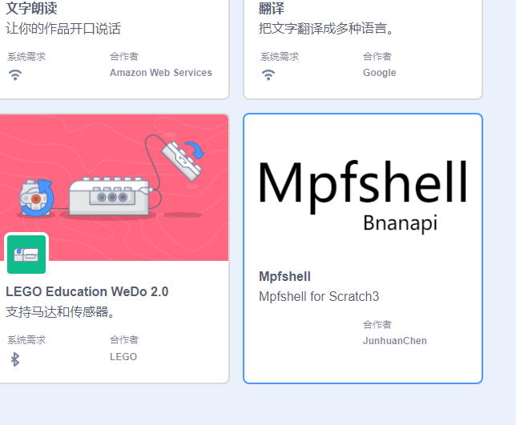

However, it does not work yet. You need to provide this plugin in your scratch-vm.

## scratch-vm

open `extension-manager.js` in `\Scratch3\scratch-vm\src\extension-support` .

```javascript
const Scratch3EimBlocks = require('../extensions/scratch3_eim');
const Scratch3MpfshellBlocks = require('../extensions/scratch3_mpfshell');

const builtinExtensions = {
    // After the other Extensions
    eim: Scratch3EimBlocks, // add eim extension
    mpfshell: Scratch3MpfshellBlocks, // add mpfshell extension
};
```

This completes the plug-in offering.

If you click on the plugin and nothing happens, you need to re-click `yarn unlink` and `yarn link` in `scratch-vm`.

## scratch-mpfshell

click image directory.

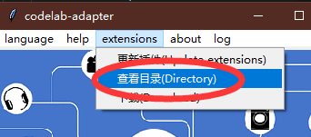

move `extensions` to `codelab_adapter\extensions`.

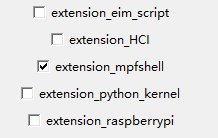

checked extension_mpfshell start mpfshell.

into scratch3 select mpfshell extension, let's play!

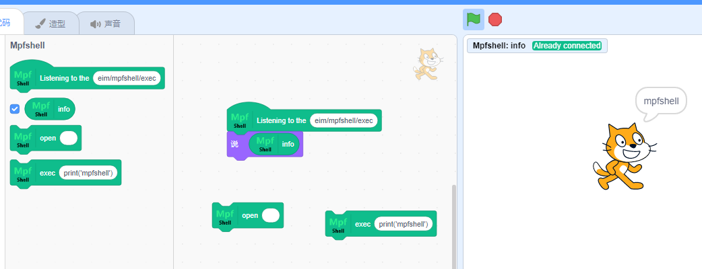

### add bpi:bit support!

We can use micropython firmware based on mpfshell.

According to the building blocks of mpfshell, we can make control blocks of other hardware. Here I take bpibit as an example.

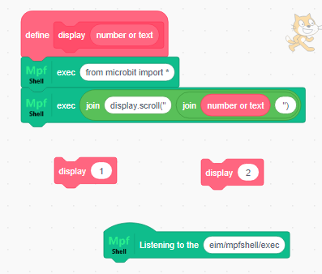

So we can convert the above definition into a built-in building block.

see `scratch3_bpibit/index.js`

Take this as an example(same as mpfshell).

1. in `extension-manager.js`

```javascript
const Scratch3BpibitBlocks = require('../extensions/scratch3_bpibit');

const builtinExtensions = {
    bpibit: Scratch3BpibitBlocks
};
```

2. in `index.jsx`

```
export default [
    // After the other plug-ins
    ,{
        name: 'Bpibit',
        extensionId: 'bpibit',
        collaborator: 'Bananapi',
        description: (
            <FormattedMessage
                defaultMessage="Bpibit for Scratch3"
                description="bpibit"
                id="gui.extension.bpibit.description"
            />
        ),
        featured: true
    }
]
```

3. in `index.js`

```javascript
const ArgumentType = require('../../extension-support/argument-type');
const BlockType = require('../../extension-support/block-type');
const formatMessage = require('format-message');
// const MathUtil = require('../../util/math-util');

const Scratch3MpfshellBlocks = require('../scratch3_mpfshell');

class Scratch3BpibitBlocks {
    constructor (runtime) {
        /**
         * The runtime instantiating this block package.
         * @type {Runtime}
         */
        this.runtime = runtime;
        this.mpfshell = new Scratch3MpfshellBlocks();
    }

    /**
     * The key to load & store a target's pen-related state.
     * @type {string}
     */
    static get STATE_KEY () {
        return 'Scratch.bpibit';
    }

    /**
     * @returns {object} metadata for this extension and its blocks.
     */
    getInfo () {
        return {
            id: 'bpibit',
            name: formatMessage({
                id: 'bpibit.categoryName',
                default: 'Bpibit',
                description: 'Use it to control your micropython'
            }),
            // menuIconURI: menuIconURI,
            blockIconURI: blockIconURI,
            // showStatusButton: true,
            blocks: [
                {
                    opcode: 'isconnected',
                    blockType: BlockType.REPORTER,
                    arguments: {}
                },
                {
                    opcode: 'connect',
                    blockType: BlockType.COMMAND,
                    text: formatMessage({
                        id: 'bpibit.connect',
                        default: 'connect [DATA]',
                        description: 'connect micropython device.'
                    }),
                    arguments: {
                        DATA: {
                            type: ArgumentType.STRING,
                            defaultValue: formatMessage({
                                id: 'bpibit.defaultArgsToOpen',
                                default: '',
                                description: 'connect device name(default is none to find).'
                            })
                        }
                    }
                },
                {
                    opcode: 'display',
                    blockType: BlockType.COMMAND,
                    text: formatMessage({
                        id: 'bpibit.dispaly',
                        default: 'dispaly [DATA]',
                        description: 'dispaly led pixel'
                    }),
                    arguments: {
                        DATA: {
                            type: ArgumentType.STRING,
                            defaultValue: formatMessage({
                                id: 'bpibit.defaultTextToDispaly',
                                default: 'hello world!',
                                description: 'bpibit display.'
                            })
                        }
                    }
                }
            ],
            menus: {

            }
        };
    }

    display (args) {
        const cmd = "display.scroll('" + args.DATA + "')";
        // console.log(cmd);
        this.mpfshell.exec({mutation: null, TOPIC: 'eim/mpfshell/exec', DATA: cmd});
    }

    connect (DATA) {
        this.mpfshell.open(DATA);
        this.mpfshell.exec({mutation: null, TOPIC: 'eim/mpfshell/exec', DATA: 'from microbit import *'});
    }

    isconnected () {
        this.mpfshell.isconnected();

        return this.mpfshell.return_info();
    }

}

module.exports = Scratch3BpibitBlocks;

```

then your see this.

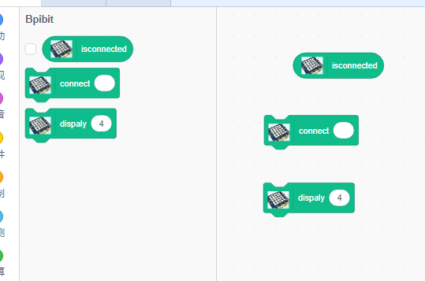

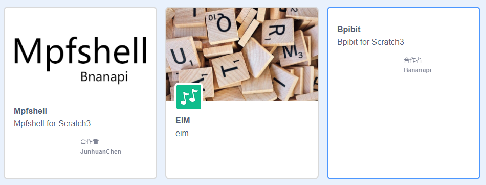

make hardware for scratch3 by yourself. let go!